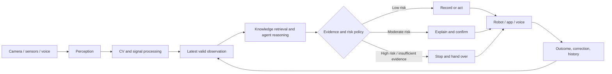

[English](README.md) | [中文](README.zh.md)

# ROBIN

## An AI-native growing companion for small households

ROBIN connects computer vision, conversational intelligence, and mobile robotics into an explainable and controllable home-growing system. Its purpose is not to replace care with automation, but to reduce the cognitive burden of observing, interpreting, and consistently responding to plant needs.

> **Core loop: Perceive → Interpret → Recommend → Confirm → Act → Verify**

[Chinese portfolio case-study copy](docs/portfolio-case-study.zh.md) · [Full technical guide](docs/technical/implementation-guide.md)

## At a glance

| | |
| --- | --- |
| Domain | AI products, intelligent hardware, robotics, home growing |
| My role | Team lead; product strategy, AI interaction architecture, robot prototyping, CV deployment |
| Team | Seven-person interdisciplinary team |
| Technology | Swift-YOLO, LLM dialogue, ESP32-S3, voice interaction, embedded vision |
| Status | Voice and on-device vision demonstrated; cross-module loop designed and awaiting integration validation |

## The product opportunity

Home growers rarely fail because information does not exist. They struggle because knowledge, live conditions, and action are fragmented. Identification apps interpret a photo, timers execute fixed schedules, and general assistants answer questions; none maintains a reliable loop between what is happening now and what should happen next.

ROBIN is designed to connect five responsibilities: observe the physical environment; turn perception into structured, time-bound evidence; explain evidence in the context of a plant and its history; route action according to risk and human authority; and verify outcomes as context for future decisions.

## AI-native architecture

## Capability maturity

| Status | Capabilities |
| --- | --- |
| **Demonstrated** | ESP32-S3 voice interaction, Robin persona, OLED state feedback, custom Swift-YOLO crop recognition, on-device inference |
| **Designed** | CV-to-dialogue context bridge, evidence display, risk-based confirmation, low-confidence recovery, plant profiles, cross-touchpoint state sync |
| **Future** | Soil and environmental sensors, watering and movement, long-term personalised memory, multi-device coordination |

## Human–AI principles

- **Evidence before advice** — expose source and freshness.
- **Automate by risk** — consequence determines autonomy.
- **Explain the next action** — make recommendations actionable and reversible.
- **Keep humans in control** — support edit, reject, pause, and takeover.
- **Fail visibly and safely** — never fill missing evidence with invented certainty.

## Honest prototype boundary

The repository includes flashable firmware, upstream ESP-IDF source, hardware guidance, and a crop-vision training path. Voice interaction and on-device crop recognition have been demonstrated separately. The CV-to-dialogue bridge, app experience, sensor-informed care, and physical actions are designed integration paths rather than completed end-to-end claims.

## Product roadmap

| Phase | Product goal |
| --- | --- |
| **Observe** | Build reliable, time-bound plant observations |
| **Assist** | Provide grounded advice using vision, sensors, and plant knowledge |
| **Act** | Execute low-risk work with confirmation, takeover, and recovery |
| **Learn** | Improve long-term care through outcomes and user corrections |

## Documentation

- [Portfolio case-study copy and image plan — Chinese](docs/portfolio-case-study.zh.md)
- [Capability map — Chinese](docs/product/capability-map.zh.md)
- [Interaction principles and reusable patterns — Chinese](design-assets/ai-patterns/interaction-principles.zh.md)
- [AI experience evaluation scorecard — Chinese](design-assets/evaluation/ai-experience-scorecard.zh.md)
- [Missing material checklist — Chinese](docs/materials-needed.zh.md)
- [Full English technical guide](docs/technical/implementation-guide.md)
- [完整中文技术指南](docs/technical/implementation-guide.zh.md)
- [Firmware and source](Robin_main/)

## Attribution

The voice prototype builds on the Tech Talkies ESP32 AI Desk Buddy tutorial and the Xiaozhi ecosystem. Vision training follows the Seeed Studio XIAO ESP32S3 deployment workflow. ROBIN's original contribution is the agricultural product definition, custom crop-recognition work, evidence-aware persona, CV–LLM–hardware integration design, and reusable interaction assets for explainable and controllable AI behaviour. Full sources and licensing notes remain in the technical guides.
