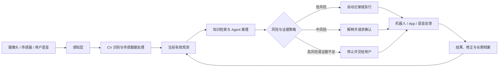

[中文](README.zh.md) | [English](README.md)

# ROBIN

## 面向家庭种植场景的 AI Native 成长伙伴

ROBIN 将计算机视觉、对话智能与移动机器人连接成一个可解释、可控制、可持续学习的家庭种植系统。它关注的不是“让机器人替人种植”，而是降低观察、判断与持续照料植物的认知负担，让缺乏专业经验的家庭种植者逐渐建立自己的养护能力。

> **核心闭环：感知 → 理解 → 建议 → 确认 → 行动 → 验证**

[个人网站展示文档](docs/portfolio-case-study.zh.md) · [完整技术实现与复现指南](docs/technical/implementation-guide.zh.md)

> **主视觉待补充**：将机器人置于真实家庭种植或小型农场场景中，并同时露出机器人、植物和移动端三个触点。建议文件位置：`assets/hero/robin-hero.webp`。

## 项目信息

| 项目 | 内容 |
| --- | --- |
| 项目类型 | AI 产品、智能硬件、移动机器人、家庭农业 |
| 我的作用 | 团队负责人；产品策略、AI 交互架构、机器人原型、CV 部署与跨专业协作 |
| 团队 | 7 人跨学科团队 |
| 核心技术 | Swift-YOLO、LLM 对话、ESP32-S3、语音交互、嵌入式视觉 |
| 当前状态 | 语音与设备端视觉原型已演示；跨模块闭环仍在联调与验证 |

## 为什么是 ROBIN

家庭种植的问题往往不是“缺少知识”，而是知识、现场状态和行动彼此割裂：识别 App 可以描述一张照片，定时浇水器可以执行固定动作，智能音箱可以回答问题，但它们都难以持续理解“这株植物此刻发生了什么，以及下一步应该由谁做什么”。

ROBIN 将价值建立在一条连续关系上：

1. **观察现场**：摄像头与未来的环境传感器形成带时间戳的观测。
2. **形成理解**：CV 输出结构化识别结果，而非直接生成结论。
3. **解释证据**：Agent 结合当前观测、植物档案与养护知识生成可理解的建议。
4. **分配行动**：低风险任务可以自动完成；中高风险任务需要用户确认或人工处理。
5. **验证结果**：执行结果与用户修正进入植物档案，成为下一轮判断的上下文。

这使 ROBIN 从一个“会聊天的机器人”变成一个围绕真实任务组织感知、知识、决策与行动的 AI Native 产品系统。

## 商业与产品机会

### 目标用户

有种植兴趣，但缺少经验、时间不稳定，或难以持续观察植物变化的家庭用户和小型种植者。

### 当前替代方案的断点

| 方案 | 识别现场 | 解释状态 | 物理行动 | 长期上下文 |
| --- | --- | --- | --- | --- |
| 植物识别 App | 部分 | 有限 | 无 | 弱 |
| 定时浇水设备 | 传感器 | 弱 | 有 | 弱 |
| 通用语音助手 | 无 | 通用知识 | 无 | 部分 |
| ROBIN 的目标 | 有 | 有依据地解释 | 分阶段接入 | 植物档案与历史反馈 |

### 产品价值

- 对用户：减少重复观察和判断压力，把模糊症状转化为下一步行动。
- 对产品：以机器人硬件为入口，延伸植物档案、高级诊断、养护服务与设备协同。
- 对团队：用统一的数据契约、风险等级和交互模式连接 AI、硬件、App 与服务设计。

## AI Native 产品架构

> **架构图待替换**：建议补一张正式视觉图，用实线表示已实现、虚线表示已设计、浅灰表示未来能力。文件位置：`assets/diagrams/ai-system-architecture.webp`。

## 能力与成熟度

为了避免把概念设计描述成已经交付的系统，ROBIN 使用三个成熟度层级：

| 状态 | 能力 |
| --- | --- |
| **Demonstrated 已演示** | ESP32-S3 语音交互、Robin 人格、OLED 状态、Swift-YOLO 自定义作物识别、设备端推理 |
| **Designed 已设计** | CV 结果注入对话上下文、证据卡片、风险确认、低置信度恢复、App 植物档案与多触点状态同步 |
| **Future 未来能力** | 土壤与环境传感器、自动浇水、机器人行动、长期个性化记忆与多设备协同 |

详细能力地图见 [`docs/product/capability-map.zh.md`](docs/product/capability-map.zh.md)。

## 人与 AI 的协作原则

1. **Evidence before advice**：任何状态判断都必须说明数据来源与时间。
2. **Automate by risk**：自动化程度取决于错误后果，而不是模型能否生成答案。
3. **Explain the next action**：建议必须转化为清楚、具体、可撤销的下一步。
4. **Keep humans in control**：用户始终可以修改、暂停、拒绝和接管。
5. **Fail visibly and safely**：证据不足、观测过期或设备异常时，系统明确停止而不是补全想象。

完整规则及可复用交互模式见 [`design-assets/ai-patterns/interaction-principles.zh.md`](design-assets/ai-patterns/interaction-principles.zh.md)。

## 可复用设计资产

- `Evidence Card`：展示模型依据、来源、时间与置信信息。
- `AI Recommendation`：把判断转换为可执行建议。
- `Confirm Before Action`：在改变植物状态前明确影响与确认内容。
- `Low-confidence Recovery`：请求补拍、选择目标或补充传感数据。
- `Human Takeover`：暂停自动化并清楚移交控制权。
- `Safe Stop`：在断连、观测过期或动作失败时进入安全状态。

这些资产既可以服务 ROBIN，也可以复用于医疗穿戴、家庭机器人和其他具身智能产品。

## 原型与证据

当前仓库保留了可烧录固件、上游 ESP-IDF 源码、硬件连接和 CV 训练路径。现阶段已经能够证明：

- 机器人能够通过麦克风、扬声器和 OLED 完成具有明确角色边界的语音交互；
- 自定义作物数据可以训练为 Swift-YOLO 模型并部署到 XIAO ESP32-S3 视觉设备；
- 对话提示词能够在没有实时数据时拒绝编造土壤、天气和病害状态；
- CV 与对话服务之间需要独立桥接层，不能把模型标签或静态 Persona 当作动态上下文同步。

尚不能声称：CV 与语音模块已经完成端到端联调，或机器人已经根据 Agent 决策执行自动浇水和移动任务。

> **证据待补充**：原型照片、串口或识别日志、真实对话录屏、数据集版本、模型评估结果和至少一组失败案例。见 [`docs/materials-needed.zh.md`](docs/materials-needed.zh.md)。

## 验证框架

ROBIN 的验证不只关注“AI 是否回答”，还检查 Grounding、理解度、跨触点一致性、失败恢复、用户控制和真实任务价值。测试模板见 [`design-assets/evaluation/ai-experience-scorecard.zh.md`](design-assets/evaluation/ai-experience-scorecard.zh.md)。

## 产品路线图

| 阶段 | 目标 | 核心验证 |
| --- | --- | --- |
| **Observe** | 识别植物并建立可靠观察记录 | 识别一致性、时效和目标消歧 |
| **Assist** | 结合知识和传感数据生成有依据的建议 | 理解度、采纳率与不支持声明 |
| **Act** | 执行低风险任务，支持确认和接管 | 任务成功率、接管率与恢复时间 |
| **Learn** | 根据结果和用户修正调整长期策略 | 长期使用价值与策略改进 |

## 技术实现与复现

原有技术内容已完整保留：

- [中文技术实现与复现指南](docs/technical/implementation-guide.zh.md)
- [English implementation and reproduction guide](docs/technical/implementation-guide.md)
- [固件与源代码](Robin_main/)
- [参考接线图](Robin_main/circuit.png)

## 项目边界与来源

语音硬件原型基于 Tech Talkies 的 ESP32 AI Desk Buddy 教程和 Xiaozhi 生态；视觉训练参考 Seeed Studio 的 XIAO ESP32S3 部署流程。本项目的原创工作重点是：农业机器人产品定义、自定义作物识别数据与部署、Robin 人格及证据边界、CV—LLM—硬件的接入设计，以及面向可解释、可控制 AI 体验的设计资产沉淀。具体来源、许可证及复现条件见技术指南。
